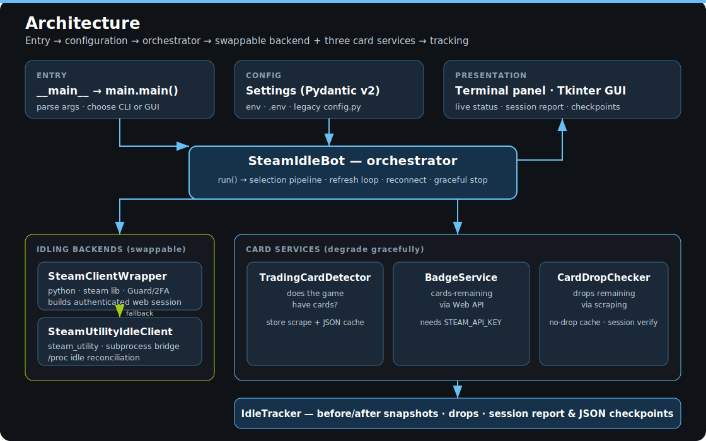
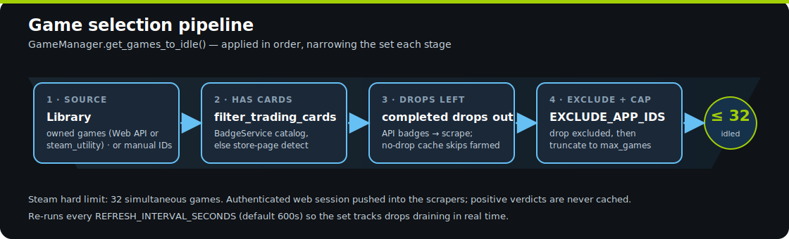

<p align="center">
  
</p>

<p align="center">
  <a href="https://www.python.org/downloads/"></a>
  <a href="https://github.com/astral-sh/uv"></a>
  
  
  <a href="LICENSE"></a>
  <a href="docs/en/README.md"></a>
  <a href="docs/pt-br/README.md"></a>
</p>

> **Farm Steam playtime and trading-card drops on autopilot.** Steam Idle Bot syncs your
> library, idles **only** the games that still have cards to drop, and remembers what's
> already finished — so every run scans less and starts faster. Live terminal dashboard,
> optional desktop GUI, two interchangeable idling backends with automatic fallback.

---

## Why it's different

Most idlers blindly run every game forever. Steam Idle Bot is **accurate and self-pruning**:

| | |
|---|---|
| 🎴 **Drops only where it matters** | Detects which games have trading cards and how many drops remain — idles just those, never wasting a slot on a drained game. |
| 🧠 **Learns over time** | Persistent no-drop caches record fully-farmed games; short-lived positive caches avoid re-scraping active games every refresh. |
| 🔐 **Accurate by design** | Verifies the Steam web session is *genuinely* logged in before trusting it; auto-recovers a valid session from a browser you're signed into. |
| 🖥️ **Readable output** | Live panel of game names, cards remaining and idle time; structured session report + optional JSON/Markdown checkpoints. |
| 🔁 **Two backends, one interface** | Built-in Python client (Steam Guard / 2FA) **or** a local `steam-utility` install — with transparent fallback if one fails. |
| 🔄 **Rotates when cards drain** | Inventory snapshots can prove a game dropped all known remaining cards before badge pages catch up, so refreshes can replace it mid-session. |
| ⚡ **Modern & tested** | `uv`-managed, fully typed, 560 tests across Python 3.12–3.14. |

---

## Quick start

```bash
# 1. Install uv (if needed)
curl -LsSf https://astral.sh/uv/install.sh | sh

# 2. Clone & install
git clone https://github.com/bernardopg/steam-idler-python.git
cd steam-idler-python
uv sync

# 3. Configure (never commit the filled .env)
cp .env.example .env
#    edit .env → USERNAME, PASSWORD, and ideally STEAM_API_KEY

# 4. Preview without contacting Steam
./run.sh --dry-run

# 5. Run it — terminal, or ./run-gui.sh for the desktop GUI
./run.sh
```

> 💡 A free [Steam Web API key](https://steamcommunity.com/dev/apikey) unlocks automatic
> library sync and badge-based filtering. Without it the bot still runs — it just can't
> filter as precisely.

---

## How it works

The orchestrator wires a configuration layer to a swappable idling backend and three card
services, then drives a refresh loop that tracks drops as they drain.

<p align="center">
  
</p>

Game selection is a **funnel** — each stage narrows the set, capped at Steam's hard limit of 32:

<p align="center">
  
</p>

---

## Common commands

```bash
./run.sh                              # run normally (terminal)
./run.sh --dry-run                    # print config + chosen games, no Steam contact
./run.sh --no-trading-cards           # skip trading-card filtering
./run.sh --max-games 10               # cap idled games
./run.sh --refresh-interval-seconds 300   # re-run selection every 5 min
./run.sh --checkpoint-minutes 5 --duration-minutes 25  # timed run + JSON/MD checkpoints
./run.sh --stop-app-ids "570,730"     # stop steam-utility idles for those App IDs and exit
STEAM_IDLE_SKIP_SYNC=1 ./run.sh       # skip the runner's preflight uv sync
STEAM_IDLE_RUNNER_VERBOSE=1 ./run.sh  # show uv sync output while preparing the environment
./run-gui.sh                          # desktop GUI
```

`./run.sh` keeps the Python bot out of a shell pipeline so `Ctrl+C` reaches it directly, writes bot output to `logs/runs/run_*.log`, and prints a short startup/exit banner. By default it clears stale exported Steam Idle Bot environment overrides so `.env` wins; set `STEAM_IDLE_PRESERVE_ENV=1` when you intentionally want exported variables to override `.env`.

Full flag and setting reference: **[USAGE guide](docs/en/USAGE.md)**.

---

## Configuration

Settings come from environment variables / a `.env` file (copy `.env.example`). The two
required values are `USERNAME` and `PASSWORD`; everything else has sane defaults.

| Key | Default | Purpose |
|-----|---------|---------|
| `STEAM_API_KEY` | — | Library sync + badge filtering *(recommended)* |
| `IDLING_BACKEND` | `python` | `python` or `steam_utility` |
| `MAX_GAMES_TO_IDLE` | `30` | Cap (Steam hard limit: 32) |
| `REFRESH_INTERVAL_SECONDS` | `600` | How often the selection pipeline re-runs |
| `CHECKPOINT_MINUTES` | `0` | Write JSON/MD checkpoints every N min (0 = off) |
| `DURATION_MINUTES` | `0` | Stop after N min (0 = run until interrupted) |
| `POST_RUN_VERIFY_SECONDS` | `0` | Re-scrape card counts N s after stopping |
| `AUTO_BROWSER_COOKIES` | `true` | Recover a community session from a logged-in browser |

> 🔐 Card-drop filtering needs an **authenticated `web:community` session**. See the
> [authentication & accuracy guide](docs/en/README.md#-authentication--card-drop-accuracy).

---

## Documentation

|                | 🇺🇸 English | 🇧🇷 Português (BR) |
| -------------- | ----------- | ------------------ |
| Full guide     | [README](docs/en/README.md) | [README](docs/pt-br/README.md) |
| Command sheet  | [USAGE](docs/en/USAGE.md)   | [USAGE](docs/pt-br/USAGE.md)   |
| Security       | [SECURITY](docs/en/SECURITY.md) | [SECURITY](docs/pt-br/SECURITY.md) |
| Roadmap & backlog | [BACKLOG](BACKLOG.md) | [BACKLOG](BACKLOG.md) |

---

## Requirements

- **Python 3.12+** — managed for you by `uv`
- **A Steam account** with games that have trading cards
- **Steam Web API key** *(recommended)* — library sync + badge data
- **For drop filtering** — an authenticated Steam web session

---

## Contributing

Contributions welcome in both languages. Run `uv run ruff check . && uv run mypy src && uv run pytest -q`
before opening a PR. See the developer guides:
[🇺🇸 English](docs/en/README.md#-developer-guide) · [🇧🇷 Português](docs/pt-br/README.md#-guia-do-desenvolvedor).
The prioritized roadmap lives in **[BACKLOG.md](BACKLOG.md)**.

## License

MIT — see [LICENSE](LICENSE). Not affiliated with Valve. Use responsibly and follow Steam's Terms of Service.
